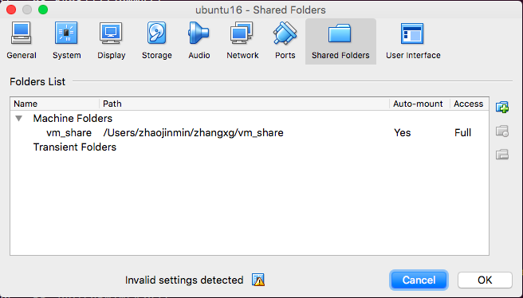

# using the ubuntu16 image

### Download the [vm file](https://drive.google.com/file/d/109tZ5F0Y3WUUrW3EzKQR80lyvffb8Xfi/view?usp=sharing)

The image is based on ubuntu16, with the following packake installed:

    1. ros-kinetic-desktop-full
    2. dbw_mkz
    3. git
    4. pip
    5. the `source /opt/ros/kinetic/setup.bash` is source in `~/.bashrc`

### import the image in VirtualBox


Some things to make life easier:
1. clipboard is bi-directionally enabled;
2. the copy/paste keymapping in terminal is changed to ctrl-x (for copy) and ctrl-v (for paste), (no need ctrl-shift-c/v)
3. the folder share is enabled, so that you can develop in host (with the familiar tools available) and compile/run in vm. 

to use the folder share: goes to "Devices->Shared Folders->Shared Folders Settings"

 1. define the host folder to share 
 

 change the file to your file path;

 2. mount a folder in vm
 
 the VM already created a folder under `~/host_share`
 perform mount:

 ```
sudo mount -t vboxsf -o uid=$UID,gid=$(id -g) vm_share ~/host_share
 ```


### run the project

now you can compile and run the project code in the vm. 
I created a `launch.sh` file to start the ros nodes. 

```
#! /bin/bash

# clean log
rm -rf ~/.ros/log

# build 
catkin_make
source devel/setup.sh
roslaunch src/CarND-Capstone/ros/launch/styx.launch
```


